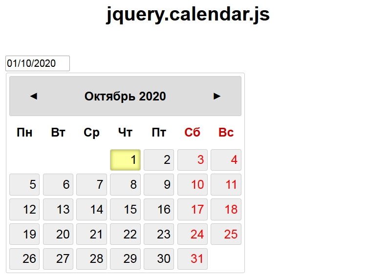

# jquery.calendar.js
Ссылка: https://alexaltrex.github.io/jquery.calendar.js

## Описание
Плагин jQuery - календарь

## Запуск проекта:
1. Клонирование и запуск: git clone https://github.com/Alexaltrex/jquery.calendar.js.git;
2. Переход в директорию с проектом: cd jquery.calendar.js;
3. Запуск файла index.html;

## Цель проекта
* Изучение программирования плагинов jQuery;
* Изучение jQuery, в частности анимации;

## Разработка
* Код - jQuery v.3.4.1;
* Верстка - предпроцессор SASS (конкретно SCSS);
